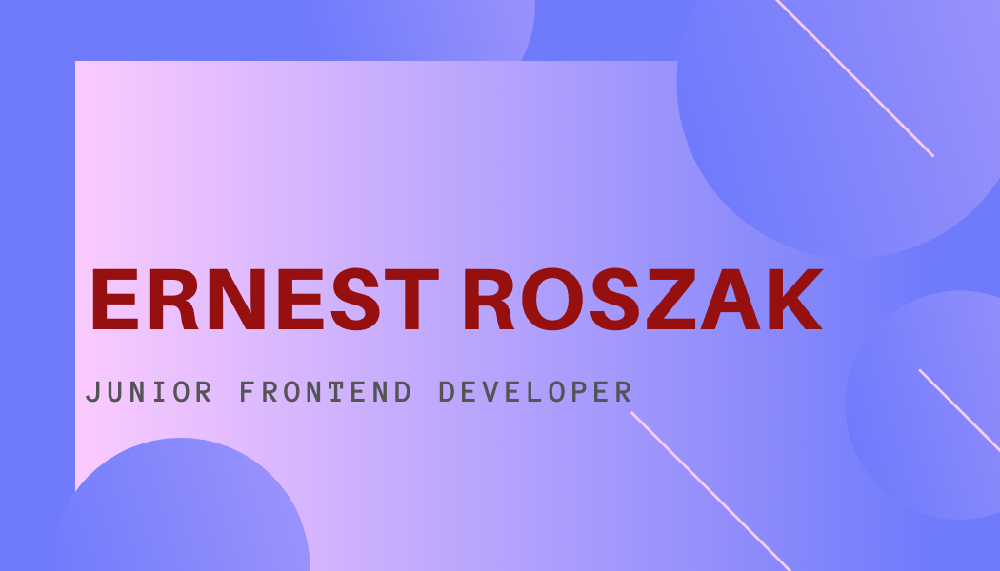

# General information

*This page is part of my Portfolio as Frontend Developer*

## Working knowledge
✔ Semantic HTML5

✔ Flexbox

✔ Markdown

✔ JS: Local storage

✔ Figma

✔ CSS grid

✔ Forms

✔ JS: DOM manipulations

✔ SASS

## Know something about:
⚪ JavaScript ES6 + features

⚪ CSS animations

⚪ Working with API

⚪ NPM Scripts

⚪ Progresive web apps

⚪ GIT

⚪ Accessibility

## How to use it?

Click on `Use this template` button to generate a new repository based on this starter kit. After that clone it to your computer, go to the project directory in console and type `npm install`.

## Available scripts

`npm run start` - runs development mode

`npm run build` - runs build process for production

`npm run publish` - runs build process and publish the page using `gh-pages` branch

